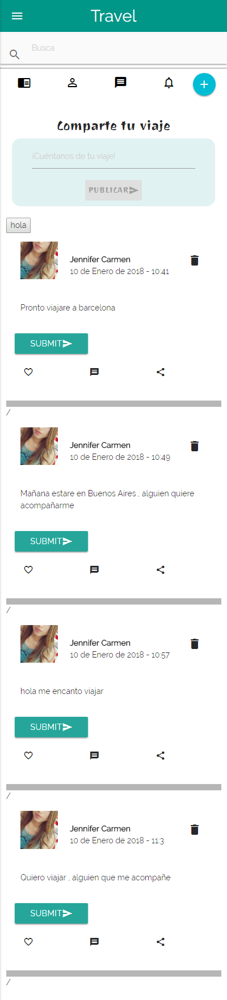
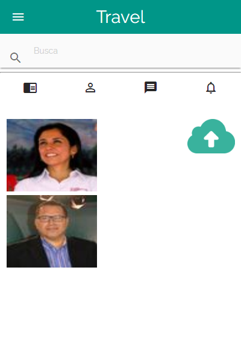
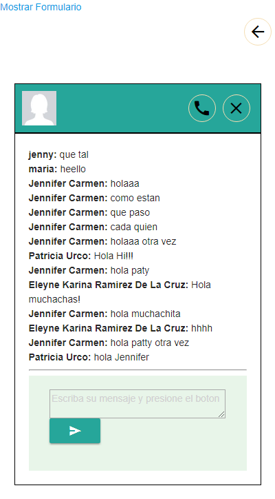
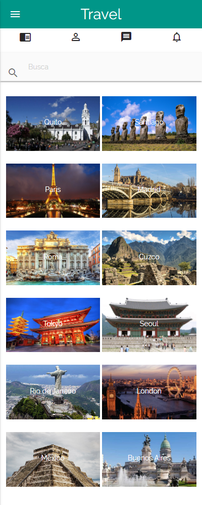
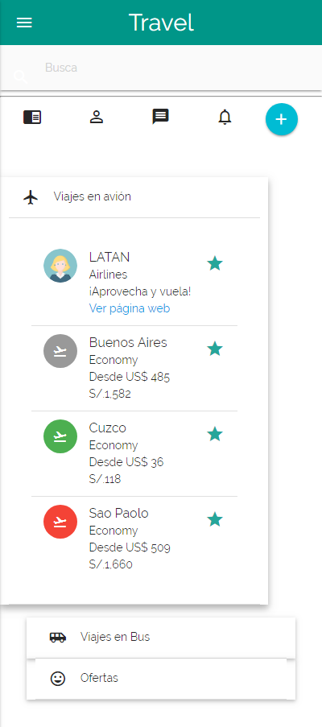

# ** Red Social **
* **Curso:** _CREA TU PROPIA RED SOCIAL_
* **Unidad:** _NO REINVENTES LA RUEDA_

***
## Objetivos

El objetivo es crear una red social exitosa que tenga en cuenta algunos puntos básicos que debe tener una red social, los cuales son:

+ Perfiles de usuarios.
+ Un lugar donde poder escribir posts.
+ Un newsfeed donde puedes ver las actualizaciones de todos tus contactos.
+ Un lugar para subir fotos.
+ Capacidad para poder tener amigos y seguir a personas y marcas.
+ Ser mobile friendly, etc.

## Funcionalidad y flujo de la aplicación

+ Vista splash que redirecciona a la vista home

+ Al ingresar con Facebook o Google, te redirecciona a la página donde se ven las publicaciones. Éstas se guardan en una base de datos (firebase).

+ Vista para subir fotos que también se almacena en una base de datos.

+ Chat totalmente funcional.

+ Vista donde el viajero busca los lugares que quiere conocer.

+ Vista de las opciones de viaje, se consideraron viajes en avión y en bus, además de las promociones por temporada.

## Planificación

Se dividió el trabajo en etapas, las cuales se detallan a continuación:

+ En la primera etapa se definió el diseño y el UI de la red social, se tomó en cuenta los puntos principales de una red social.

+ En la segunda etapa se definió el framework a utilizar y las tareas de cada integrante.

+ La tercera etapa consistió en realizar el producto final en sí, con todas las herramientas aprendidas en el Bootcamp y trabajando colaborativamente en GitHub. 

## Observaciones

+ Se utilizó Firebase para realizar la autenticación del usuario mediante el acceso con Facebook y Google.

+ Se aplicó Firebase para almacenar la información de las publicaciones y del chat del usuario en una base de datos.

## webSite
* Puede ver el [Proyecto en vivo](https://jennifercarmen.github.io/RED-SOCIAL/)

## Desarrollado con:

`HTML5` `Jquery` `CSS3` `Materialize` `Firebase`

***

## Creditos
* Carmen Sosa Jennifer
* Eleyne
* Patricia
